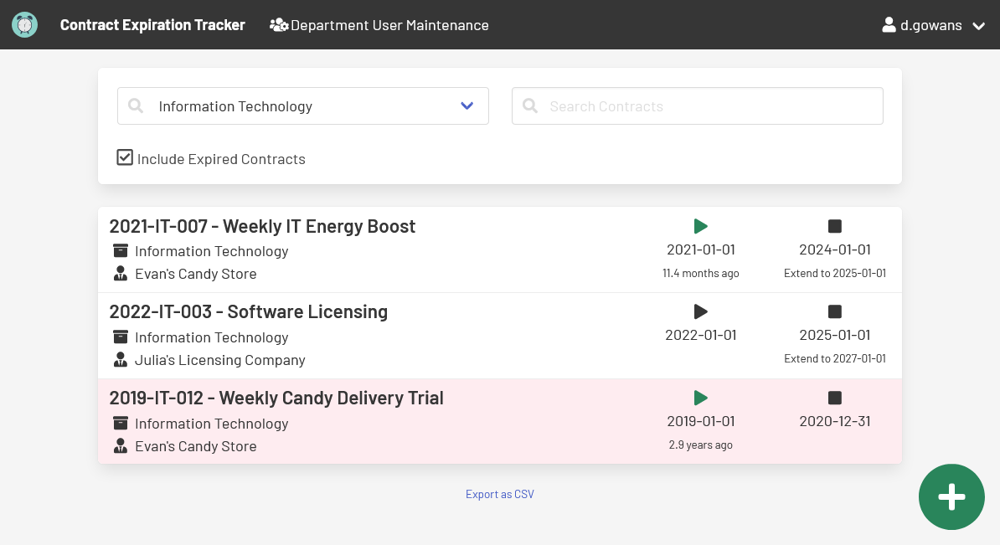

# Contract Expiration Tracker

A tool to track expirations of procurement projects and/or contracts
to help prepare for and be proactive on upcoming sourcing requirements.

**Launched May 2022.**

📘 [Read the Documentation](https://cityssm.github.io/contract-expiration-tracker/docs/)
