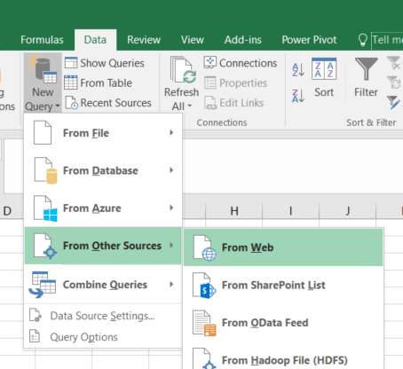
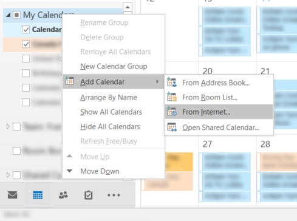

[Home](https://cityssm.github.io/contract-expiration-tracker/)
·
[Documentation](./)

## Exporting Results

Below the search results, there are export options.
**Note that the search filters apply to the exports.**

There are two export formats available.

-   **CSV** of comma-separated values is a table format.
    It works with many spreadsheet applications, like Microsoft Excel,
    and all text editors.

-   **iCal** is a calendar format.
    It is compatible with applications like Microsoft Outlook.

When exporting, you have two options.

-   Click the button,
    and download the current search results.
    Once downloaded, the search results in the file are static,
    and will not update with any changes made in the system.

-   Right-click the button,
    and copy the link for use in your application of choice.
    The application can use that link to retrieve a current copy
    of the search results.

### How to Use a Live CSV Link with Microsoft Excel

*Note that this is just the basics, not a full Microsoft Excel tutorial.*

Start by filtering the search results.
Once satisfied, right-click the CSV export button, and copy the link.

Open Microsoft Excel.
Select the "Data" ribbon.
In the "Get and Transform" section, select "New Query".
Under "From Other Sources", select "From Web".

Paste the link in the URL field.

After agreeing to any security warnings,
and verifying the data looks correct,
the search results will appear as a table in the spreadsheet.

To retrieve the latest data, click the "Refresh All" button.

### How to Use a Live iCal Link with Microsoft Outlook

*Note that this is just the basics, not a full Microsoft Outlook tutorial.*

Start by filtering the search results.
Once satisfied, right-click the iCal export button, and copy the link.

Open Microsoft Outlook.
Navigate to the Calendars view.
In the calendars list, right-click one of the calendar group headings.
Under "Add Calendar", select "From Internet".

Paste the link in popup window.

After agreeing to the subsequent popups,
a new calendar will appear with the search results.
